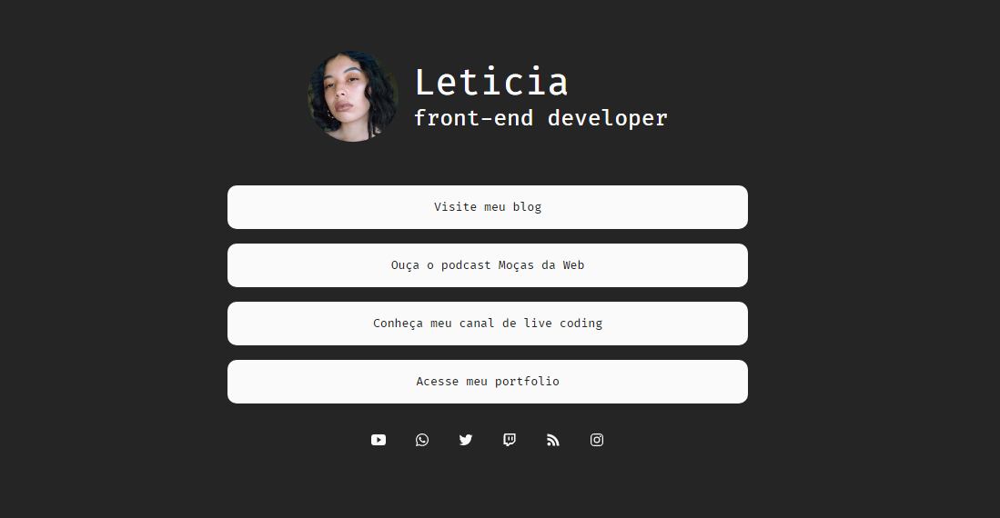

# Links




> O projeto foi criado para estudar HTML e CSS. A ideia era criar a minha versão do [Linktree](https://linktr.ee).

## 🚀 Instalando 'Links'

Para instalar o MyLinktree, siga estas etapas:

```
git clone https://github.com/levxyca/my-linktree.git
```

ou 

1. Fork este repositório.
2. Crie um branch: `git checkout -b <nome_branch>`.
3. Faça suas alterações e confirme-as: `git commit -m '<mensagem_commit>'`

## ☕ Usando 'Links'
Para usar MyLinktree, siga estas etapas:

O `style.css` eestá otimizado e comprimido, então para ver suas alterações você precisar retirar ele e linkar o `reset.css` e o `style-raw.css` ao projeto.

Depois que tiver todas as alterações prontas você pode utilizar algum site que comprime o CSS, como o [CSS Minifier](https://cssminifier.com) e pegar o CSS comprimido e colar no seu `style.css`.

Feito isso, basta voltar a linkar apenas o seu `style.css`.

---------------------------

<p align="center">
Feito com :hearts: por <a href="https://github.com/levxyca">Leticia Caroline Leonardo</a>
