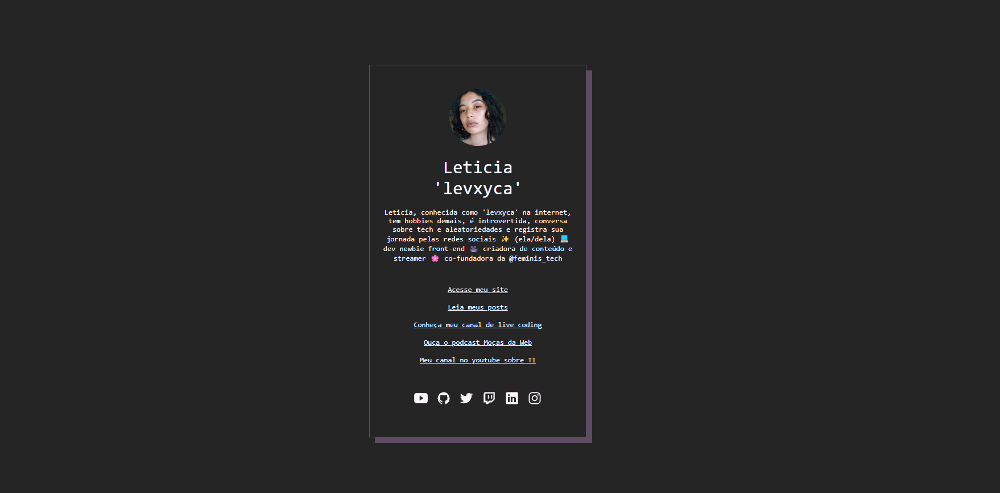

# Links




> Um projeto onde você pode colocar todos os seus links que considera importantes.

## 🚀 Instalando 'Links'

Para instalar, siga estas etapas:

```
git clone https://github.com/levxyca/my-linktree.git
```

ou 

1. Fork este repositório.
2. Crie um branch: `git checkout -b <nome_branch>`.
3. Faça suas alterações e confirme-as: `git commit -m '<mensagem_commit>'`

## ☕ Usando 'Links'

Para ver o tutorial de como usar um template no GitHub, [clique aqui](https://docs.github.com/pt/repositories/creating-and-managing-repositories/creating-a-repository-from-a-template).

---------------------------

<p align="center">
Feito com :hearts: por <a href="https://github.com/levxyca">levxyca</a>
